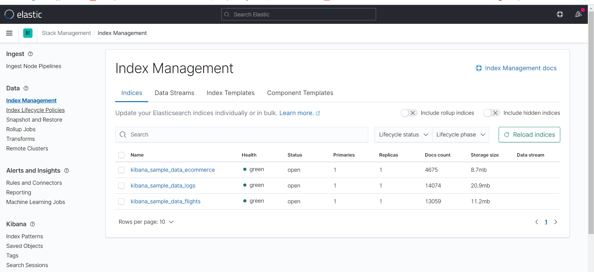

@[toc]
### 1.ES安装
#### 1.1 资源规划
硬件资源为3台虚拟机，配置如下：

|hostname|ip|cpu|内存|磁盘|操作系统|
|-|-|-|-|-|-|
|m162p201|192.168.162.201|2|8G|500G|CentOS Linux release 7.7.1908 (Core)|
|m162p201|192.168.162.201|2|8G|500G|CentOS Linux release 7.7.1908 (Core)|
|m162p201|192.168.162.201|2|8G|500G|CentOS Linux release 7.7.1908 (Core)|

上述硬件配置将按如下命名规划：

|hostname|ip|cluster|node|用户|seed_hosts|master_nodes|
|-|-|-|-|-|-|-|
|m162p201|192.168.162.201|es162|node201|elastic|T|T|
|m162p201|192.168.162.201|es162|node202|elastic|T|T|
|m162p201|192.168.162.201|es162|node203|elastic|T|F|

#### 1.2 安装软件
elasticsearch将安装在用户elastic下。创建用户脚本并上传软件：
```
//创建一个elastic用户用以运行elasticsearch
useradd elastic
passwd elastic

//sftp上传到 /home/elastic
ls
-rw-r--r-- 1 elastic elastic 327143992 Jul 23 20:23 elasticsearch-7.13.4-linux-x86_64.tar.gz
-rw-r--r-- 1 elastic elastic 306413260 Jul 23 20:23 kibana-7.13.4-linux-x86_64.tar.gz

//解压
tar -zxvf elasticsearch-7.13.4-linux-x86_64.tar.gz
tar -zxvf kibana-7.13.4-linux-x86_64.tar.gz
```
按上述操作，分别在以上3个节点中执行。
为了便于我们后续扩容，在真实场景中，可能存在一个机器部署多个节点的情况，那么我们可以使用软链接：
```
mv elasticsearch-7.13.4  elasticsearch-7.13.4-node201
ln -s /home/elastic/elasticsearch-7.13.4-node201 /home/elastic/node201
```
这样后续我们就可以通过这个软链接方便的访问了。当然，如果生产环境，data目录可能也需要根据磁盘情况来重新规划，本文中的虚拟环境暂不考虑了。

#### 1.3 检查句柄数
检查句柄数,如果过低，在/etc/security/limits.conf增加如下内容：
```
elastic  soft nproc 16384
elastic  hard nproc 16384
elastic  soft nofile 65535
elastic  hard nofile 65536
```
或者一劳永逸的改为：
```
* soft nproc 10000
* hard nproc 10000
* soft nofile 1048576
* hard nofile 1048576
```
之后通过 ulimited -a 进行检查:
```
[elastic@m162p201 config]$ ulimit -a
core file size          (blocks, -c) 0
data seg size           (kbytes, -d) unlimited
scheduling priority             (-e) 0
file size               (blocks, -f) unlimited
pending signals                 (-i) 31850
max locked memory       (kbytes, -l) 64
max memory size         (kbytes, -m) unlimited
open files                      (-n) 1048576
pipe size            (512 bytes, -p) 8
POSIX message queues     (bytes, -q) 819200
real-time priority              (-r) 0
stack size              (kbytes, -s) 8192
cpu time               (seconds, -t) unlimited
max user processes              (-u) 10000
virtual memory          (kbytes, -v) unlimited
file locks                      (-x) unlimited
```
open files 即是文件句柄数。

#### 1.4 调整vm.max_map_count
如果vm.max_map_count值过低，会造成elasticsearch启动之后会自动关闭并报错。
调整方式如下:
解决办法，修改：
```
 vim /etc/sysctl.conf
```
末尾增加：
```
vm.max_map_count=262144
```
之后执行：
```
 sysctl -p
```
这样该配置项就会永久生效了。

#### 1.5 jvm配置
如果不配置elastic用户的jvm参数，那么elasticsearch在启动的时候将会用elastcsearch自带的jdk启动，elasticsearch7.13.4 自带的jdk是 OpenJDk 16。我们可以切换到hotspot的1.8版本上来，这也是elasticsearch7.13所支持的最低版本。
修改.bash_profile:
```
# .bash_profile

# Get the aliases and functions
if [ -f ~/.bashrc ]; then
        . ~/.bashrc
fi

# User specific environment and startup programs

PATH=$PATH:$HOME/.local/bin:$HOME/bin

export PATH
#新增jvm参数
JAVA_HOME=/usr/java/jdk1.8.0_231-amd64
ES_JAVA_HOME=/usr/java/jdk1.8.0_231-amd64
export JAVA_HOME ES_JAVA_HOME
export PATH=.:$JAVA_HOME/bin:$PATH
export CLASSPATH=.:$JAVA_HOME/lib/dt.jar:$JAVA_HOME/lib/tools.jar
```
之后运行：
```
source ./bash_profile
```
让这个配置生效。这样我们就能启动elasticsearch了。

#### 1.5 ES配置文件
##### 1.5.1 node201 elasticsearch.yml
```
# ======================== Elasticsearch Configuration =========================
#
# NOTE: Elasticsearch comes with reasonable defaults for most settings.
#       Before you set out to tweak and tune the configuration, make sure you
#       understand what are you trying to accomplish and the consequences.
#
# The primary way of configuring a node is via this file. This template lists
# the most important settings you may want to configure for a production cluster.
#
# Please consult the documentation for further information on configuration options:
# https://www.elastic.co/guide/en/elasticsearch/reference/index.html
#
# ---------------------------------- Cluster -----------------------------------
#
# Use a descriptive name for your cluster:
#
cluster.name: es162
#
# ------------------------------------ Node ------------------------------------
#
# Use a descriptive name for the node:
#
node.name: node201
#
# Add custom attributes to the node:
#
node.attr.rack: r1
#
# ----------------------------------- Paths ------------------------------------
#
# Path to directory where to store the data (separate multiple locations by comma):
#
path.data: /home/elastic/node201/data
#
# Path to log files:
#
path.logs: /home/elastic/node201/logs
#
# ----------------------------------- Memory -----------------------------------
#
# Lock the memory on startup:
#
#bootstrap.memory_lock: true
#
# Make sure that the heap size is set to about half the memory available
# on the system and that the owner of the process is allowed to use this
# limit.
#
# Elasticsearch performs poorly when the system is swapping the memory.
#
# ---------------------------------- Network -----------------------------------
#
# By default Elasticsearch is only accessible on localhost. Set a different
# address here to expose this node on the network:
#
network.host: 192.168.162.201
#
# By default Elasticsearch listens for HTTP traffic on the first free port it
# finds starting at 9200. Set a specific HTTP port here:
#
http.port: 9200
#
# For more information, consult the network module documentation.
#
# --------------------------------- Discovery ----------------------------------
#
# Pass an initial list of hosts to perform discovery when this node is started:
#The default list of hosts is ["127.0.0.1", "[::1]"]
#
discovery.seed_hosts: ["192.168.162.201", "192.168.162.202","192.168.162.203"]
#
# Bootstrap the cluster using an initial set of master-eligible nodes:
#
cluster.initial_master_nodes: ["node201", "node202"]
#
# For more information, consult the discovery and cluster formation module documentation.
#
# ---------------------------------- Various -----------------------------------
#
# Require explicit names when deleting indices:
#
action.destructive_requires_name: true

```
##### 1.5.2 node202 elasticsearch.yml
```
# ======================== Elasticsearch Configuration =========================
#
# NOTE: Elasticsearch comes with reasonable defaults for most settings.
#       Before you set out to tweak and tune the configuration, make sure you
#       understand what are you trying to accomplish and the consequences.
#
# The primary way of configuring a node is via this file. This template lists
# the most important settings you may want to configure for a production cluster.
#
# Please consult the documentation for further information on configuration options:
# https://www.elastic.co/guide/en/elasticsearch/reference/index.html
#
# ---------------------------------- Cluster -----------------------------------
#
# Use a descriptive name for your cluster:
#
cluster.name: es162
#
# ------------------------------------ Node ------------------------------------
#
# Use a descriptive name for the node:
#
node.name: node202
#
# Add custom attributes to the node:
#
node.attr.rack: r1
#
# ----------------------------------- Paths ------------------------------------
#
# Path to directory where to store the data (separate multiple locations by comma):
#
path.data: /home/elastic/node202/data
#
# Path to log files:
#
path.logs: /home/elastic/node202/logs
#
# ----------------------------------- Memory -----------------------------------
#
# Lock the memory on startup:
#
#bootstrap.memory_lock: true
#
# Make sure that the heap size is set to about half the memory available
# on the system and that the owner of the process is allowed to use this
# limit.
#
# Elasticsearch performs poorly when the system is swapping the memory.
#
# ---------------------------------- Network -----------------------------------
#
# By default Elasticsearch is only accessible on localhost. Set a different
# address here to expose this node on the network:
#
network.host: 192.168.162.202
#
# By default Elasticsearch listens for HTTP traffic on the first free port it
# finds starting at 9200. Set a specific HTTP port here:
#
http.port: 9200
#
# For more information, consult the network module documentation.
#
# --------------------------------- Discovery ----------------------------------
#
# Pass an initial list of hosts to perform discovery when this node is started:
# The default list of hosts is ["127.0.0.1", "[::1]"]
#
discovery.seed_hosts: ["192.168.162.201", "192.168.162.202","192.168.162.203"]
#
# Bootstrap the cluster using an initial set of master-eligible nodes:
#
cluster.initial_master_nodes: ["node201", "node202"]
#
# For more information, consult the discovery and cluster formation module documentation.
#
# ---------------------------------- Various -----------------------------------
#
# Require explicit names when deleting indices:
#
action.destructive_requires_name: true

```
##### 1.5.3 node203 elasticsearch.yml
```
# ======================== Elasticsearch Configuration =========================
#
# NOTE: Elasticsearch comes with reasonable defaults for most settings.
#       Before you set out to tweak and tune the configuration, make sure you
#       understand what are you trying to accomplish and the consequences.
#
# The primary way of configuring a node is via this file. This template lists
# the most important settings you may want to configure for a production cluster.
#
# Please consult the documentation for further information on configuration options:
# https://www.elastic.co/guide/en/elasticsearch/reference/index.html
#
# ---------------------------------- Cluster -----------------------------------
#
# Use a descriptive name for your cluster:
#
cluster.name: es162
#
# ------------------------------------ Node ------------------------------------
#
# Use a descriptive name for the node:
#
node.name: node203
#
# Add custom attributes to the node:
#
node.attr.rack: r1
#
# ----------------------------------- Paths ------------------------------------
#
# Path to directory where to store the data (separate multiple locations by comma):
#
path.data: /home/elastic/node203/data
#
# Path to log files:
#
path.logs: /home/elastic/node203/logs
#
# ----------------------------------- Memory -----------------------------------
#
# Lock the memory on startup:
#
#bootstrap.memory_lock: true
#
# Make sure that the heap size is set to about half the memory available
# on the system and that the owner of the process is allowed to use this
# limit.
#
# Elasticsearch performs poorly when the system is swapping the memory.
#
# ---------------------------------- Network -----------------------------------
#
# By default Elasticsearch is only accessible on localhost. Set a different
# address here to expose this node on the network:
#
network.host: 192.168.162.203
#
# By default Elasticsearch listens for HTTP traffic on the first free port it
# finds starting at 9200. Set a specific HTTP port here:
#
http.port: 9200
#
# For more information, consult the network module documentation.
#
# --------------------------------- Discovery ----------------------------------
#
# Pass an initial list of hosts to perform discovery when this node is started:
# The default list of hosts is ["127.0.0.1", "[::1]"]
#
discovery.seed_hosts: ["192.168.162.201", "192.168.162.202"]
#
# Bootstrap the cluster using an initial set of master-eligible nodes:
#
cluster.initial_master_nodes: ["node201", "node202"]
#
# For more information, consult the discovery and cluster formation module documentation.
#
# ---------------------------------- Various -----------------------------------
#
# Require explicit names when deleting indices:
#
action.destructive_requires_name: true

```
#### 1.6 jvm配置
elasticsearch官方不建议修改jvm.options文件，而是在jvm.options.d中进行修改。我们在这个文件夹中建一个新的jvm.options文件，添加需要的java配置。
```
-Xms2g
-Xmx2g
```
这是elasticsearch的堆内存配置，对于生产环境可以结合系统的资源情况酌情分配。

#### 1.6 启动
m162p201启动
```
[elastic@m162p201 ~]$ /home/elastic/node201/bin/elasticsearch -d
Future versions of Elasticsearch will require Java 11; your Java version from [/opt/jdk/jdk1.8.0_111/jre] does not meet this requirement. Consider switching to a distribution of Elasticsearch with a bundled JDK. If you are already using a distribution with a bundled JDK, ensure the JAVA_HOME environment variable is not set.
Future versions of Elasticsearch will require Java 11; your Java version from [/opt/jdk/jdk1.8.0_111/jre] does not meet this requirement. Consider switching to a distribution of Elasticsearch with a bundled JDK. If you are already using a distribution with a bundled JDK, ensure the JAVA_HOME environment variable is not set.

```
m162p202启动

```
[elastic@m162p202 ~]$ /home/elastic/node202/bin/elasticsearch -d
Future versions of Elasticsearch will require Java 11; your Java version from [/usr/java/jdk1.8.0_231-amd64/jre] does not meet this requirement. Consider switching to a distribution of Elasticsearch with a bundled JDK. If you are already using a distribution with a bundled JDK, ensure the JAVA_HOME environment variable is not set.
Future versions of Elasticsearch will require Java 11; your Java version from [/usr/java/jdk1.8.0_231-amd64/jre] does not meet this requirement. Consider switching to a distribution of Elasticsearch with a bundled JDK. If you are already using a distribution with a bundled JDK, ensure the JAVA_HOME environment variable is not set.
```
m162p203启动
```
[elastic@m162p203 ~]$ /home/elastic/node203/bin/elasticsearch -d
Future versions of Elasticsearch will require Java 11; your Java version from [/usr/java/jdk1.8.0_231-amd64/jre] does not meet this requirement. Consider switching to a distribution of Elasticsearch with a bundled JDK. If you are already using a distribution with a bundled JDK, ensure the JAVA_HOME environment variable is not set.
Future versions of Elasticsearch will require Java 11; your Java version from [/usr/java/jdk1.8.0_231-amd64/jre] does not meet this requirement. Consider switching to a distribution of Elasticsearch with a bundled JDK. If you are already using a distribution with a bundled JDK, ensure the JAVA_HOME environment variable is not set.

```

#### 1.7 安装es过程中遇到的问题
##### 1.7.1 vm.max_map_count太小
max virtual memory areas vm.max_map_count [65530] is too low
```
[2021-07-28T14:59:46,424][INFO ][o.e.n.Node               ] [node201] initialized
[2021-07-28T14:59:46,425][INFO ][o.e.n.Node               ] [node201] starting ...
[2021-07-28T14:59:46,596][INFO ][o.e.x.s.c.f.PersistentCache] [node201] persistent cache index loaded
[2021-07-28T14:59:47,100][INFO ][o.e.t.TransportService   ] [node201] publish_address {192.168.162.201:9300}, bound_addresses {192.168.162.201:9300}
[2021-07-28T14:59:47,530][INFO ][o.e.b.BootstrapChecks    ] [node201] bound or publishing to a non-loopback address, enforcing bootstrap checks
[2021-07-28T14:59:47,538][ERROR][o.e.b.Bootstrap          ] [node201] node validation exception
[1] bootstrap checks failed. You must address the points described in the following [1] lines before starting Elasticsearch.
bootstrap check failure [1] of [1]: max virtual memory areas vm.max_map_count [65530] is too low, increase to at least [262144]
ERROR: [1] bootstrap checks failed. You must address the points described in the following [1] lines before starting Elasticsearch.
bootstrap check failure [1] of [1]: max virtual memory areas vm.max_map_count [65530] is too low, increase to at least [262144]
ERROR: Elasticsearch did not exit normally - check the logs at /home/elastic/node201/logs/es162.log
[2021-07-28T14:59:47,541][INFO ][o.e.n.Node               ] [node201] stopping ...
[2021-07-28T14:59:47,559][INFO ][o.e.n.Node               ] [node201] stopped
[2021-07-28T14:59:47,560][INFO ][o.e.n.Node               ] [node201] closing ...
[2021-07-28T14:59:47,577][INFO ][o.e.n.Node               ] [node201] closed

```

解决办法，修改：
```
 vim /etc/sysctl.conf
```
末尾增加：
```
vm.max_map_count=262144
```


##### 1.7.2 JAVA_HOME is deprecated
错误如下：
```
[elastic@m162p201 ~]$ /home/elastic/node201/bin/elasticsearch -d
warning: usage of JAVA_HOME is deprecated, use ES_JAVA_HOME
Future versions of Elasticsearch will require Java 11; your Java version from [/opt/jdk/jdk1.8.0_111/jre] does not meet this requirement. Consider switching to a distribution of Elasticsearch with a bundled JDK. If you are already using a distribution with a bundled JDK, ensure the JAVA_HOME environment variable is not set.
warning: usage of JAVA_HOME is deprecated, use ES_JAVA_HOME
Future versions of Elasticsearch will require Java 11; your Java version from [/opt/jdk/jdk1.8.0_111/jre] does not meet this requirement. Consider switching to a distribution of Elasticsearch with a bundled JDK. If you are already using a distribution with a bundled JDK, ensure the JAVA_HOME environment variable is not set.

```
这是由于ES的环境变量将不再使用$JAVA_HOME,而是$ES_JAVA_HOME。配置上即可。
修改后的.bash_profile
```
# .bash_profile

# Get the aliases and functions
if [ -f ~/.bashrc ]; then
        . ~/.bashrc
fi

# User specific environment and startup programs

PATH=$PATH:$HOME/.local/bin:$HOME/bin

export PATH

JAVA_HOME=/opt/jdk/jdk1.8.0_111
ES_JAVA_HOME=/opt/jdk/jdk1.8.0_111
export JAVA_HOME ES_JAVA_HOME
export PATH=.:$JAVA_HOME/bin:$PATH
export CLASSPATH=.:$JAVA_HOME/lib/dt.jar:$JAVA_HOME/lib/tools.jar
```
进行测试：
```
[elastic@m162p201 ~]$ echo $ES_JAVA_HOME
/opt/jdk/jdk1.8.0_111
```

##### 1.7.3 java版本过低
```
[elastic@m162p201 ~]$ /home/elastic/node201/bin/elasticsearch -d
Future versions of Elasticsearch will require Java 11; your Java version from [/opt/jdk/jdk1.8.0_111/jre] does not meet this requirement. Consider switching to a distribution of Elasticsearch with a bundled JDK. If you are already using a distribution with a bundled JDK, ensure the JAVA_HOME environment variable is not set.
Future versions of Elasticsearch will require Java 11; your Java version from [/opt/jdk/jdk1.8.0_111/jre] does not meet this requirement. Consider switching to a distribution of Elasticsearch with a bundled JDK. If you are already using a distribution with a bundled JDK, ensure the JAVA_HOME environment variable is not set.

```
提示需要升级jdk版本到11，最低支持版本为jdk1.8


### 2.kibana安装
#### 2.1 软件安装
 软件版本：kibana-7.13.4-linux-x86_64.tar.gz
```
 //上传到elastic用户并解压
 kibana-7.13.4-linux-x86_64.tar.gz
 tar -zxvf  kibana-7.13.4-linux-x86_64.tar.gz
 //软连接
  ln -s /home/elastic/kibana-7.13.4-linux-x86_64 /home/elastic/kibana
```

#### 2.2 kibana配置
```
# Kibana is served by a back end server. This setting specifies the port to use.
server.port: 5601

# Specifies the address to which the Kibana server will bind. IP addresses and host names are both valid values.
# The default is 'localhost', which usually means remote machines will not be able to connect.
# To allow connections from remote users, set this parameter to a non-loopback address.
server.host: "192.168.162.201"

# Enables you to specify a path to mount Kibana at if you are running behind a proxy.
# Use the `server.rewriteBasePath` setting to tell Kibana if it should remove the basePath
# from requests it receives, and to prevent a deprecation warning at startup.
# This setting cannot end in a slash.
#server.basePath: ""

# Specifies whether Kibana should rewrite requests that are prefixed with
# `server.basePath` or require that they are rewritten by your reverse proxy.
# This setting was effectively always `false` before Kibana 6.3 and will
# default to `true` starting in Kibana 7.0.
server.rewriteBasePath: false

# Specifies the public URL at which Kibana is available for end users. If
# `server.basePath` is configured this URL should end with the same basePath.
#server.publicBaseUrl: ""

# The maximum payload size in bytes for incoming server requests.
#server.maxPayload: 1048576

# The Kibana server's name.  This is used for display purposes.
#server.name: "your-hostname"

# The URLs of the Elasticsearch instances to use for all your queries.
elasticsearch.hosts: ["http://192.168.162.201:9200","http://192.168.162.202:9200"]

# Kibana uses an index in Elasticsearch to store saved searches, visualizations and
# dashboards. Kibana creates a new index if the index doesn't already exist.
kibana.index: ".kibana"

# The default application to load.
kibana.defaultAppId: "https://atom.io/packages/atom-markdown-image-pastehome"

# If your Elasticsearch is protected with basic authentication, these settings provide
# the username and password that the Kibana server uses to perform maintenance on the Kibana
# index at startup. Your Kibana users still need to authenticate with Elasticsearch, which
# is proxied through the Kibana server.
#elasticsearch.username: "kibana_system"
#elasticsearch.password: "pass"

# Enables SSL and paths to the PEM-format SSL certificate and SSL key files, respectively.
# These settings enable SSL for outgoing requests from the Kibana server to the browser.
#server.ssl.enabled: false
#server.ssl.certificate: /path/to/your/server.crt
#server.ssl.key: /path/to/your/server.key

# Optional settings that provide the paths to the PEM-format SSL certificate and key files.
# These files are used to verify the identity of Kibana to Elasticsearch and are required when
# xpack.security.http.ssl.client_authentication in Elasticsearch is set to required.
#elasticsearch.ssl.certificate: /path/to/your/client.crt
#elasticsearch.ssl.key: /path/to/your/client.key

# Optional setting that enables you to specify a path to the PEM file for the certificate
# authority for your Elasticsearch instance.
#elasticsearch.ssl.certificateAuthorities: [ "/path/to/your/CA.pem" ]

# To disregard the validity of SSL certificates, change this setting's value to 'none'.
#elasticsearch.ssl.verificationMode: full

# Time in milliseconds to wait for Elasticsearch to respond to pings. Defaults to the value of
# the elasticsearch.requestTimeout setting.
elasticsearch.pingTimeout: 1500

# Time in milliseconds to wait for responses from the back end or Elasticsearch. This value
# must be a positive integer.
elasticsearch.requestTimeout: 30000

# List of Kibana client-side headers to send to Elasticsearch. To send *no* client-side
# headers, set this value to [] (an empty list).
#elasticsearch.requestHeadersWhitelist: [ authorization ]

# Header names and values that are sent to Elasticsearch. Any custom headers cannot be overwritten
# by client-side headers, regardless of the elasticsearch.requestHeadersWhitelist configuration.
#elasticsearch.customHeaders: {}

# Time in milliseconds for Elasticsearch to wait for responses from shards. Set to 0 to disable.
#elasticsearch.shardTimeout: 30000

# Logs queries sent to Elasticsearch. Requires logging.verbose set to true.
#elasticsearch.logQueries: false

# Specifies the path where Kibana creates the process ID file.
pid.file: /home/elastic/kibana/kibana.pid

# Enables you to specify a file where Kibana stores log output.
#logging.dest: stdout

# Set the value of this setting to true to suppress all logging output.
#logging.silent: false

# Set the value of this setting to true to suppress all logging output other than error messages.
#logging.quiet: false

# Set the value of this setting to true to log all events, including system usage information
# and all requests.
#logging.verbose: false

# Set the interval in milliseconds to sample system and process performance
# metrics. Minimum is 100ms. Defaults to 5000.
#ops.interval: 5000

# Specifies locale to be used for all localizable strings, dates and number formats.
# Supported languages are the following: English - en , by default , Chinese - zh-CN .
i18n.locale: "en"
```

#### 2.4 启动kibana
```
cd /home/elastic/kibana
nohup bin/kibana &
```
这样我们就启动了一个没有用户的kibana

个人感觉新版本的kibana非常强大，后续专门在进行详细配置和使用说明。
