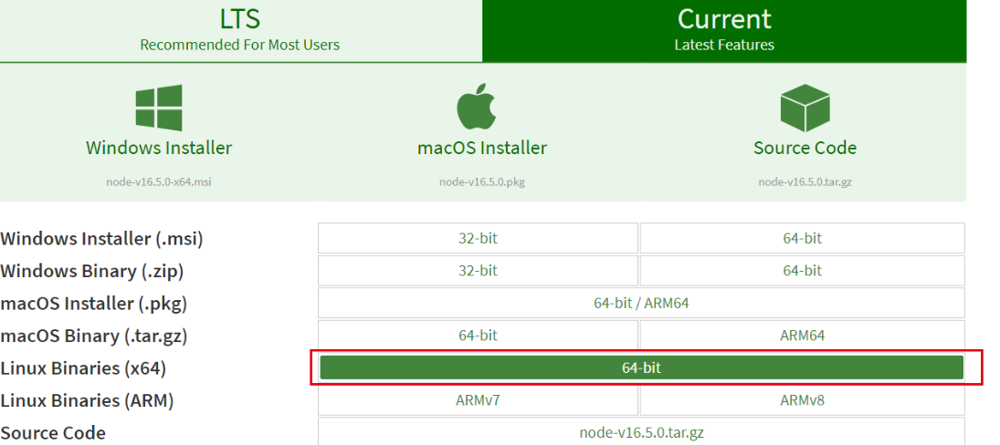
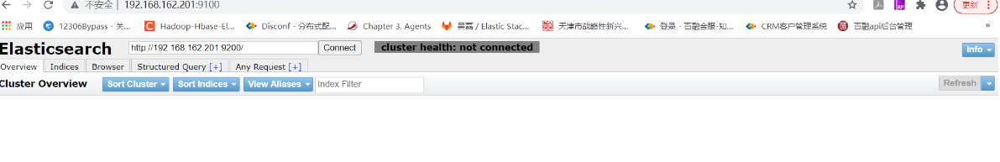
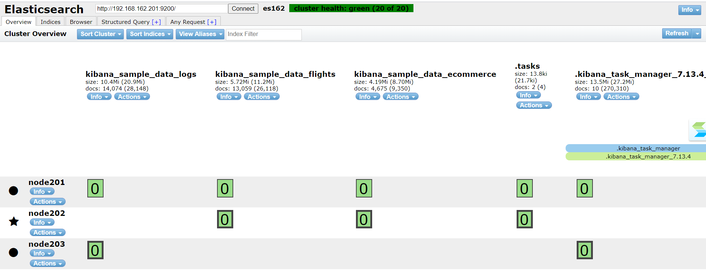

[TOC]

对于head插件，由于现在我们的es版本为7.13.4，在之前5以下的版本安装的时候只需要通过插件就能安装。而大于5的版本，则需要安装node，并需要提前安装grunt，之后通过npm的方式才能安装。

### 1.安装node.js
nodejs的最新版本下载路径https://nodejs.org/en/download/current/。

选择对应的操作系统即可。我们采用的是centos7,x64操作系统，因此我们选择linux 的x64二进制版本下载即可。
下载的最新版本文件为：
node-v16.5.0-linux-x64.tar.xz
将上述文件上传到/opt/software目录。
```
由于采用的是xz压缩，因此先要通过xz解压
xz -d node-v16.5.0-linux-x64.tar.xz 
mkdir /opt/node 
cd /opt/node
tar -xvf /opt/software/node-v16.5.0-linux-x64.tar
```
最终得到的node_home为/opt/node/node-v16.5.0-linux-x64

环境变量配置，由于我们目前只需要在elastic中使用nodejs，因此我们只在elastic用户下面来配置环境变量：
```
NODE_HOME=/opt/node/node-v16.5.0-linux-x64
export PATH=.:$NODE_HOME/bin:$PATH
export NODE_PATH=/home/elastic/node_modules
```
此时nodejs安装的modules目录为/home/elastic/nodejs_modules，读者可以根据自己的需要自行决定安装目录。
检查一下安装情况：
```
[elastic@m162p201 ~]$ node -v
v16.5.0
[elastic@m162p201 ~]$ npm -v
7.19.1
```
### 2.安装依赖的npm包


```
cd /home/elastic
git clone https://github.com/mobz/elasticsearch-head.git

cd elasticsearch-head

npm install  grunt --registry=https://registry.npm.taobao.org
```
上述执行完成之后，在elasticsearch-head中运行install
```
[elastic@m162p201 elasticsearch-head]$ npm install
npm WARN EBADENGINE Unsupported engine {
npm WARN EBADENGINE   package: 'karma@1.3.0',
npm WARN EBADENGINE   required: { node: '0.10 || 0.12 || 4 || 5 || 6' },
npm WARN EBADENGINE   current: { node: 'v16.5.0', npm: '7.19.1' }
npm WARN EBADENGINE }
npm WARN EBADENGINE Unsupported engine {
npm WARN EBADENGINE   package: 'http2@3.3.7',
npm WARN EBADENGINE   required: { node: '>=0.12.0 <9.0.0' },
npm WARN EBADENGINE   current: { node: 'v16.5.0', npm: '7.19.1' }
npm WARN EBADENGINE }
npm WARN deprecated urix@0.1.0: Please see https://github.com/lydell/urix#deprecated
npm WARN deprecated resolve-url@0.2.1: https://github.com/lydell/resolve-url#deprecated
npm WARN deprecated json3@3.3.2: Please use the native JSON object instead of JSON 3
npm WARN deprecated json3@3.2.6: Please use the native JSON object instead of JSON 3
npm WARN deprecated uuid@3.4.0: Please upgrade  to version 7 or higher.  Older versions may use Math.random() in certain circumstances, which is known to be problematic.  See https://v8.dev/blog/math-random for details.
npm WARN deprecated har-validator@5.1.5: this library is no longer supported
npm WARN deprecated request@2.88.2: request has been deprecated, see https://github.com/request/request/issues/3142
npm WARN deprecated chokidar@1.7.0: Chokidar 2 will break on node v14+. Upgrade to chokidar 3 with 15x less dependencies.
npm WARN deprecated phantomjs-prebuilt@2.1.16: this package is now deprecated
npm WARN deprecated core-js@2.6.12: core-js@<3.3 is no longer maintained and not recommended for usage due to the number of issues. Because of the V8 engine whims, feature detection in old core-js versions could cause a slowdown up to 100x even if nothing is polyfilled. Please, upgrade your dependencies to the actual version of core-js.
npm WARN deprecated http2@3.3.7: Use the built-in module in node 9.0.0 or newer, instead
npm WARN deprecated coffee-script@1.10.0: CoffeeScript on NPM has moved to "coffeescript" (no hyphen)

added 525 packages, and audited 526 packages in 2m

5 packages are looking for funding
  run `npm fund` for details

39 vulnerabilities (6 low, 7 moderate, 25 high, 1 critical)

To address issues that do not require attention, run:
  npm audit fix

To address all issues (including breaking changes), run:
  npm audit fix --force

Run `npm audit` for details.
```
安装过程中提示版本过低，需要升级：
```
[elastic@m162p201 elasticsearch-head]$  npm audit fix --force
npm WARN using --force Recommended protections disabled.
npm WARN audit Updating http-proxy to 1.18.1,which is outside your stated dependency range.
npm WARN audit Updating grunt to 1.4.1,which is outside your stated dependency range.
npm WARN audit Updating grunt-contrib-watch to 1.1.0,which is outside your stated dependency range.
npm WARN audit Updating grunt-karma to 4.0.2,which is a SemVer major change.
npm WARN audit Updating karma to 6.3.4,which is a SemVer major change.
npm WARN audit Updating grunt-contrib-jasmine to 3.0.0,which is a SemVer major change.

added 312 packages, removed 307 packages, changed 75 packages, and audited 531 packages in 2m

26 packages are looking for funding
  run `npm fund` for details

found 0 vulnerabilities
```
### 3.elasticsearch-head 配置
Gruntfile.js中修改为如下配置：
```
connect: {
                    server: {
                            options: {
                                    hostname: "192.168.162.201",
                                    port: 9100,
                                    base: '.',
                                    keepalive: true
                            }
                    }
            }

```
这是head插件的监听IP和端口。
之后修改：
/home/elastic/elasticsearch-head/_site/app.js
```
this.base_uri = this.config.base_uri || this.prefs.get("app-base_uri") || "http://192.168.162.201:9200";
```
这个配置就完成了。

### 4.elasticsearch的跨域问题
此外还需要在elasticsearch中增加支持跨域访问的配置，否则，head插件将无法连接到es。

我们修改跨域配置之后再连接：
在/home/elastic/node201/config/elasticsearch.yml中增加如下内容：
```
# 是否支持跨域
http.cors.enabled: true

# *表示支持所有域名
http.cors.allow-origin: "*"
```
重启elasticsearch。


### 4.启动head插件
```
nohup /home/elastic/elasticsearch-head/node_modules/grunt/bin/grunt server &

```
启动之后访问http://192.168.162.201:9100/效果如下图：



